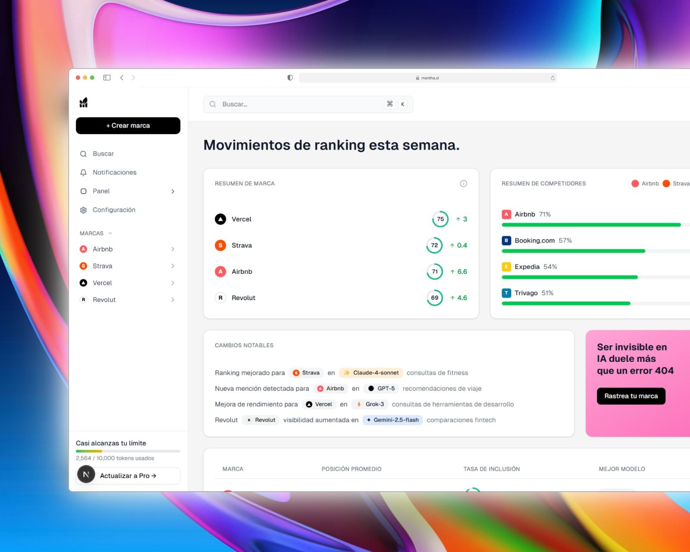

# Mentha - IA-SEO Brand Analytics Dashboard



A modern and comprehensive dashboard for analyzing brand visibility in search engines and AI models. Track your brand's performance across different queries and AI models, monitor competitors, and get actionable insights to improve your digital presence.

## 🚀 Features

### 📊 Main Dashboard
- **Brand Summary**: Visualize your brand's performance across different metrics
- **Competitor Analysis**: Compare your position with similar brands
- **Notable Changes**: Stay up to date with the latest updates and improvements
- **Data Table**: Detailed view of average positions and inclusion rates

### 🤖 IA-SEO Monitoring
- **AI Crawlers**: Monitor AI bot activity on your website
- **Query Analysis**: Track how AI models respond to queries related to your brand
- **Real-time Metrics**: Updated statistics on visits, indexed pages, and trends

### 🎨 Modern Interface
- **Dark/Light Mode**: Adaptive interface with consistent theming
- **Responsive Design**: Optimized for desktop and mobile devices
- **UI Components**: Built with shadcn/ui for a premium experience

## 🛠️ Technologies

- **Framework**: Next.js 15.2.4 with App Router
- **Language**: TypeScript
- **Styling**: Tailwind CSS 4.1.11
- **UI Components**: shadcn/ui with Radix UI
- **Icons**: Lucide React
- **State**: React Hooks with localStorage for persistence

## ⚠️ Project Status

**Currently only frontend is implemented.** The project is in development and uses mock data for demonstration. Planned implementations include:

- **Backend API** with Next.js API Routes
- **Database** (SQLite/PostgreSQL) for data persistence
- **Authentication System** with NextAuth.js
- **External APIs** for IA-SEO data collection
- **Web scraping** for automatic competitor monitoring

## 📦 Installation

1. **Clone the repository**
   ```bash
   git clone https://github.com/beenruuu/brand-analytics-dashboard.git
   cd brand-analytics-dashboard
   ```

2. **Install dependencies**
   ```bash
   npm install
   # or
   pnpm install
   ```

3. **Run the development server**
   ```bash
   npm run dev
   # or
   pnpm dev
   ```

4. **Open your browser**
   Visit [http://localhost:3000](http://localhost:3000)

## 📁 Project Structure

```
mentha/
├── app/                    # Next.js App Router pages
│   ├── dashboard/         # Main dashboard
│   ├── brand/[id]/        # Individual brand pages
│   │   ├── crawlers/      # AI crawler monitoring
│   │   ├── queries/       # Query analysis
│   │   └── page.tsx       # Brand details
│   ├── search/            # Brand search
│   ├── settings/          # User settings
│   └── layout.tsx         # Main layout
├── components/            # Reusable components
│   ├── ui/               # Base shadcn/ui components
│   ├── app-sidebar.tsx   # Navigation sidebar
│   └── dark-mode-toggle.tsx # Dark mode toggle
├── lib/                  # Utilities and configurations
├── hooks/               # Custom hooks
└── public/              # Static assets
```

## 🎯 Usage

### Main Navigation
- **Dashboard**: General overview of your brand's performance
- **Search**: Find and analyze new brands
- **Notifications**: Stay up to date with important alerts
- **Settings**: Customize your experience

### Brand Analysis
1. Select a brand from the dashboard or search
2. Review the general summary and key metrics
3. Explore competitor analysis
4. Monitor AI crawler activity
5. Analyze specific queries related to your brand

## 🔧 Configuration

### System Requirements

Before starting, make sure you have installed:

- **Node.js** 18.0 or higher
- **npm** 8.0 or higher (comes included with Node.js)
- **pnpm** (optional, but recommended for better performance)
- **Git** for version control

### Verify Installation

```bash
# Verify Node.js
node --version
# Should show v18.0.0 or higher

# Verify npm
npm --version
# Should show 8.0.0 or higher

# Verify Git
git --version
# Should show the Git version
```

### Dark Theme
The dashboard includes full dark mode support:
- Your preference is automatically saved
- Consistent theme across all components
- Smooth transitions between modes

## 📈 Metrics and KPIs

- **Average Position**: Ranking in related queries
- **Inclusion Rate**: Percentage of responses that include your brand
- **Best Model**: AI model with best performance for your brand
- **Crawler Activity**: Visits and pages indexed by AI bots

## 🤝 Contributing

1. Fork the project
2. Create a feature branch (`git checkout -b feature/AmazingFeature`)
3. Commit your changes (`git commit -m 'Add some AmazingFeature'`)
4. Push to the branch (`git push origin feature/AmazingFeature`)
5. Open a Pull Request

## 📝 License

This project is licensed under the Apache License 2.0. See the `LICENSE` file for more details.

## 📞 Contact

- **Author**: beenruuu
- **Repository**: [GitHub](https://github.com/beenruuu/brand-analytics-dashboard)
- **Issues**: [Report Issues](https://github.com/beenruuu/brand-analytics-dashboard/issues)

---

*Built with ❤️ to improve brand visibility in the AI era*