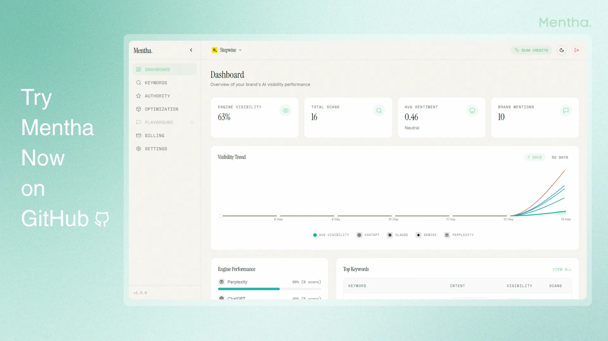

# Mentha — Open Source Answer Engine Optimization (AEO) Platform



**Track, Analyze, and Optimize your brand visibility across ChatGPT, Perplexity, Gemini, and Claude.** Mentha is the first open-source Answer Engine Optimization (AEO) platform that uses real browser automation to capture how AI engines see your brand, then evaluates results with an LLM-as-Judge system.

[](https://github.com/beenruuu/mentha)
[](https://github.com/beenruuu/mentha)
[](https://github.com/beenruuu/mentha)
[](https://nextjs.org/)
[](https://hono.dev/)
[](https://github.com/beenruuu/mentha/pulls)

---

## What is Answer Engine Optimization (AEO)?

> **Answer Engine Optimization** is the practice of optimizing your brand's digital presence so AI chatbots and answer engines — like ChatGPT, Perplexity, Google AI Overviews, Gemini, and Claude — recommend your brand accurately, positively, and frequently when users ask questions about your industry.

Traditional SEO optimized for Google search results. AEO optimizes for the AI-generated answers that 500M+ users now consume daily. Mentha is the first production-ready, open-source platform purpose-built for this new paradigm.

---

## Key Takeaways

| Area | What Mentha Does |
|------|-----------------|
| **AI Brand Monitoring** | Automatically tracks how ChatGPT, Perplexity, Gemini, and Claude mention your brand |
| **Share of Voice (SOV)** | Measures your brand visibility vs competitors across all AI engines |
| **Sentiment Analysis** | LLM-as-Judge evaluates every mention as positive, neutral, or negative |
| **Citation Tracking** | Extracts sources and citations from AI responses to find link opportunities |
| **Competitor Intelligence** | Identifies which competitors appear and why they're being recommended |
| **Knowledge Graph** | Auto-extracts entities, claims, and relationships from AI responses |

---

## Why Mentha?

### The Problem
Every day, millions of users ask AI engines questions like "What's the best [your product]?" or "Top [your industry] tools." If your brand isn't mentioned — or worse, is mentioned negatively — you're losing trust, traffic, and revenue. Traditional SEO tools can't help because they're built for crawlers, not for conversational AI.

### The Solution
Mentha bridges this gap with a complete AEO workflow:

1. **Capture** — Uses real browser automation (Camoufox + Playwright) to navigate AI engine web UIs, submit your keywords, and capture the exact Markdown response as a real user would see it
2. **Evaluate** — An LLM-as-Judge (via OpenRouter) analyzes each response for brand visibility, sentiment, competitor mentions, hallucination detection, and entity extraction
3. **Visualize** — Real-time dashboard shows your Share of Voice, keyword performance, sentiment trends, and competitive landscape across all engines
4. **Optimize** — AI-powered recommendations help you improve your brand's presence in AI-generated answers

---

## Features

### AI Engine Support
| Engine | Capture Method | Status |
|--------|---------------|--------|
| **ChatGPT** (OpenAI) | Browser automation (chatgpt.com) or OpenRouter API | ✅ Stable (may require session login) |
| **Perplexity** | Browser automation (perplexity.ai) | ✅ Stable (may require session login) |
| **Gemini** | Browser automation (gemini.google.com) | ✅ Stable (may require session login) |
| **Claude** (Anthropic) | Browser automation (claude.ai) | ✅ Stable (may require session login) |
| **Google AI Overviews** | Browser automation | ✅ Stable |

### Platform Capabilities

- **UI Capture System**: Real Firefox browser via Camoufox + Playwright with anti-detection, human behavior simulation, and session management
- **LLM-as-Judge Evaluation**: OpenRouter (GPT-4o-mini) analyzes brand visibility, sentiment (-1.0 to 1.0), recommendation type, competitor mentions, hallucination risks, keyword intent, and entity extraction
- **Provider Connections**: Session-based authentication management for each AI engine with login, health checks, and reconnect
- **Knowledge Graph**: Auto-extracted entities, claims, and relationships for structured brand intelligence
- **BullMQ Queue System**: 4 queues (scrapers, analysis, notifications, scheduled) with Redis-backed reliability
- **Scheduled Scans**: Automated daily/weekly recurring scans via cron
- **Billing & Credits**: Usage-based credit system with plan management
- **i18n**: Full English and Spanish localization
- **Export**: CSV/ZIP export of all dashboard data
- **CLI**: Full-featured command-line interface for power users
- **MCP Server**: Model Context Protocol server for AI assistant tool integration

---

## Project Structure

```
mentha/
├── apps/
│   ├── web/              # Next.js 14 frontend (dashboard, landing, onboarding)
│   ├── api/              # Hono backend (PGlite DB, BullMQ workers, Camoufox)
│   ├── cli/              # Interactive CLI (Commander.js, inquirer)
│   └── mcp/              # MCP server for AI assistant tools
├── packages/
│   ├── core/             # Shared types and RPC clients
│   └── external/         # Third-party provider integrations
├── docs/                 # Documentation
├── assets/               # Images and media
└── .github/              # CI/CD workflows
```

---

## Architecture Flow

```
User → Landing Page
  → Sign In (BetterAuth)
  → Onboarding Wizard
      → Domain Analysis (Camoufox → Perplexity)
      → Brand Profile Creation
      → Keyword + Scan Trigger
  → Dashboard (real-time polling)

Backend Pipeline:
  Scan Trigger
    → BullMQ scrapers-queue
    → Scraper Worker (Camoufox + Playwright)
        → Firefox Browser
        → Navigate to AI Engine Web UI
        → Submit Query
        → Capture Markdown Response + Citations
    → LLM-as-Judge (GPT-4o-mini)
        → Brand Visibility Check
        → Sentiment Scoring
        → Competitor Detection
        → Hallucination Flagging
        → Entity Extraction
    → Dashboard (live updates via polling)
```

---

## Tech Stack

| Layer | Technology |
|-------|-----------|
| **Frontend** | React 18, Next.js 14 (App Router), TailwindCSS, Chart.js |
| **Backend** | Hono v4, Drizzle ORM, Zod, BullMQ |
| **Database** | PGlite (in-process PostgreSQL) |
| **Queue** | Redis + BullMQ (4 queues) |
| **Browser Automation** | Camoufox + Playwright (Firefox) |
| **AI Evaluation** | OpenRouter (GPT-4o-mini) |
| **Auth** | BetterAuth |
| **CLI** | Commander.js, Inquirer, Chalk |
| **i18n** | React Context-based localization |

---

## Getting Started

### Prerequisites
- **Node.js** v20+
- **pnpm** v9+
- **Redis** instance
- **Python 3.10+** (optional, for Camoufox browser automation)
- **OpenRouter API key** (optional, for LLM-as-Judge evaluation)

### Scan Execution Mode

Mentha supports two scan execution modes controlled by `MENTHA_SCAN_EXECUTION_MODE`:

| Mode | Description | Best For |
|------|-------------|----------|
| `browser` (default) | Uses Camoufox browser automation to navigate AI engine web UIs | Local development, accurate UI responses |
| `api` | Uses OpenRouter API calls instead of browser automation | SaaS deployment, server environments without browsers |
| `hybrid` | Runs both browser and API scans in parallel | Maximum coverage during development |

Set in `apps/api/.env`:
```bash
MENTHA_SCAN_EXECUTION_MODE=browser   # browser | api | hybrid
OPENROUTER_API_KEY=sk-or-...         # Required for 'api' or 'hybrid' mode
```

### Quick Install

```bash
git clone https://github.com/beenruuu/mentha.git
cd mentha
pnpm install
cp apps/api/.env.example apps/api/.env
cp apps/web/.env.example apps/web/.env
pnpm dev
```

Open [http://localhost:3000](http://localhost:3000) to start the onboarding flow.


## Documentation

| Guide | Description |
|-------|-------------|
| [AEO Reference Implementation](./docs/AEO_REFERENCE_IMPLEMENTATION.md) | Complete AEO workflow with architecture decisions |
| [API Reference](./docs/API.md) | Full API endpoint documentation |
| [Architecture Guide](./docs/ARCHITECTURE.md) | System design and data flow |
| [CLI Commands](./docs/CLI.md) | Command-line interface reference |
| [Contributing](./docs/CONTRIBUTING.md) | How to contribute to Mentha |

---

## CLI Commands

```bash
npx mentha projects list          # List all projects
npx mentha projects create        # Create a new project
npx mentha scans trigger          # Trigger a scan run
npx mentha scans status           # Check scan status
npx mentha optimization           # Get optimization recommendations
npx mentha config                 # Manage CLI configuration
npx mentha onboarding             # Run interactive onboarding
```

---

## MCP Server Integration

Mentha includes a **Model Context Protocol (MCP)** server that lets AI assistants (Claude, Cursor, etc.) directly interact with your AEO data:

- `get_brand_visibility` — Check brand presence across AI engines
- `analyze_sentiment` — Get sentiment analysis for specific keywords
- `track_competitors` — Monitor competitor mentions
- `get_optimization_tips` — Receive AI-powered improvement suggestions

---

## Use Cases

### For Marketing Teams
Track how your brand appears in ChatGPT and Perplexity responses. Identify gaps in AI-generated recommendations and optimize your content strategy accordingly.

### For SEO Professionals
Extend your toolkit beyond traditional search. Measure Share of Voice in the AI answer economy and provide clients with comprehensive AEO reports.

### For Product Teams
Monitor how your product is described by AI engines. Detect hallucinations or incorrect information and take corrective action.

### For Agencies
Offer AEO as a new service line. Use Mentha's multi-project support and export capabilities to deliver white-label reports.

---

## FAQ

### What is Answer Engine Optimization?
AEO is the practice of optimizing brand presence across AI-powered answer engines like ChatGPT, Perplexity, Gemini, and Claude. Unlike SEO (which targets Google's search results), AEO targets the conversational answers that AI generates for user queries.

### How is Mentha different from SEO tools?
Traditional SEO tools crawl websites and track keyword rankings in Google. Mentha uses real browser automation to submit queries to AI engines, captures the exact responses, and evaluates them with an LLM-as-Judge. This is fundamentally different — you see exactly what your users see when they ask AI about your brand.

### Does Mentha require API keys for AI engines?
No. Mentha uses browser automation (Camoufox + Playwright) to interact with AI engines through their web UIs, just like a real user would. You only need to log in to each engine once through the Provider Connections panel.

### Which AI engines are supported?
Perplexity, ChatGPT (OpenAI), Gemini (Google), Claude (Anthropic), and Google AI Overviews.

### Is Mentha free and open source?
Yes. Mentha is MIT-licensed open source. You can self-host it completely free. Optional features (LLM-as-Judge evaluation) require an OpenRouter API key.

### What is Share of Voice in AI search?
Share of Voice (SOV) measures how often your brand is mentioned across AI engine responses compared to competitors. A higher SOV means AI engines recommend your brand more frequently than alternatives.

### How does the LLM-as-Judge work?
GPT-4o-mini evaluates each AI response using a structured system prompt. It extracts sentiment score, brand visibility, recommendation type, competitor mentions, keyword intent, and detected entities. A heuristic fallback exists if no API key is configured.

### Can I schedule regular scans?
Yes. Mentha supports automated daily and weekly recurring scans via scheduled BullMQ jobs with cron-based triggers.

## Project Status

Mentha is under active development. The browser automation system (Camoufox) relies on AI engine web UIs which may change or require login sessions. For production reliability, use `api` scan mode with an OpenRouter API key.

**Version:** 1.0.0 (see [releases](https://github.com/beenruuu/mentha/releases))

---

## Testing & Coverage

Tests are configured with Jest but not yet written. Contributions welcome!

```bash
pnpm --filter mentha-api test
```

---

## Security

- Report vulnerabilities via [GitHub Issues](https://github.com/beenruuu/mentha/issues)
- The `docker-compose.yml` is for **development only** — do not use in production
- Never commit `.env` files or API keys

---

## License

MIT License. Built for the future of search.

---

## Star History

[](https://star-history.com/#beenruuu/mentha&Date)
