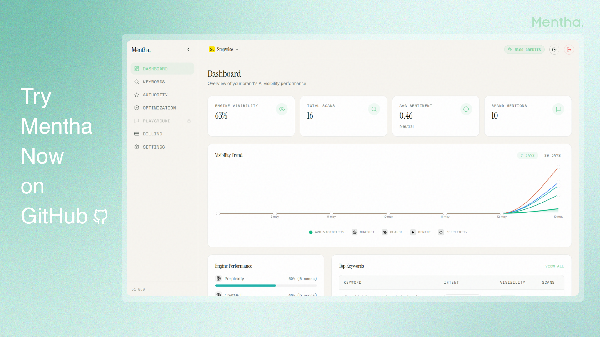

# 🌿 Mentha GUI (v1.0 Stable)



> **The Professional Answer Engine Optimization (AEO) Platform.** 
> Monitor, Analyze, and Optimize your brand visibility across the AI Search ecosystem.

[](https://github.com/beenruuu/mentha)
[](https://nextjs.org/)
[](https://hono.dev/)
[](https://bullmq.io/)
[](https://orm.drizzle.team/)

---

## 🚀 Welcome to Mentha v1.0
Mentha is a production-ready **Answer Engine Optimization (AEO)** platform. In a world where users ask ChatGPT and Perplexity instead of searching on Google, Mentha gives brands the tools to ensure they are being recommended accurately and positively.

### Key Features in v1.0
- **Universal Engine Support**: Native scanning for **Perplexity**, **ChatGPT (OpenAI)**, **Gemini**, and **Claude**.
- **UI Capture System**: Real browser automation (Camoufox + Playwright) that navigates AI engine web UIs, submits prompts, and captures rendered responses as Markdown with citations.
- **LLM-as-a-Judge**: Uses GPT-4o-mini to evaluate brand visibility, sentiment, competitor presence, hallucination detection, and entity extraction with high accuracy.
- **Provider Connections**: Manage authentication sessions for each AI engine (login, session health, reconnect).
- **Knowledge Graph**: Auto-extracted entities, claims, and relationships from AI responses for structured brand intelligence.
- **Brand Intelligence**: Inject your brand's unique description to help the system distinguish your entity from generic terms.
- **Enterprise Queue System**: Powered by **BullMQ** and **Redis** for reliable, parallelized scanning of keywords via 4 queues (scrapers, analysis, notifications, scheduled).
- **Real-time Dashboard**: Instant insights into Share of Voice (SOV), Engine Performance, keyword trends, and competitor analysis with CSV/ ZIP export.
- **Billing & Credits**: Usage-based credit system with plan management.
- **i18n Support**: Full English and Spanish localization.
- **Settings Panel**: User profile management and application preferences.
- **Optimization Reports**: AI-powered recommendations for improving brand visibility across answer engines.
- **Scheduled Scans**: Automated recurring scans (daily/weekly) with cron-based scheduling.
- **Landing Page**: Complete marketing site with Hero, Services, Methodology, Social Proof, Interactive Teaser, and FAQ sections.
- **GitHub Actions CI/CD**: Automated AEO audit workflow.

---

## 📁 Project Structure
Mentha is built as a modern TypeScript monorepo using **Turborepo** and **pnpm**:

- `apps/web`: **Next.js 14** (App Router) frontend with a premium design system, i18n, and dashboard.
- `apps/api`: **Hono** backend with PGlite in-process database, Drizzle ORM, BullMQ queues, and Camoufox browser automation.
- `apps/cli`: **Interactive CLI** for managing projects, scans, config, and optimization from the terminal.
- `apps/mcp`: **Model Context Protocol** server for AI assistant integration with tools for brand analysis and reporting.
- `packages/core`: Shared types and RPC clients.
- `packages/external`: Third-party provider integrations (browser automation, source extraction).

---

## 🛠️ Tech Stack
- **Frontend**: React 18, TailwindCSS, Lucide Icons, Chart.js, BetterAuth.
- **Backend**: Hono v4, Drizzle ORM, Zod validation, BullMQ.
- **Storage**: PGlite (in-process PostgreSQL), Redis (Queues & Cache).
- **Automation**: BullMQ (4 queues), Camoufox + Playwright (browser automation).
- **AI Integration**: OpenRouter / OpenAI SDK (GPT-4o-mini evaluator).
- **CLI**: Commander.js, inquirer, chalk, cli-table3.

---

## 🏗️ Architecture Flow

```
User → Landing (/)
  → Login (/login) [BetterAuth]
  → Onboarding (/onboarding) 
      → POST /projects/analyze (Camoufox scrapes Perplexity for brand analysis)
      → POST /projects + POST /keywords + POST /scans/trigger
  → Dashboard (/dashboard) [polls every 10s]

Backend Pipeline:
  Scan Trigger → BullMQ scrapers-queue → Scraper Worker
    → Camoufox/Playwright browser automation
      → Navigate to AI engine web UI (chatgpt.com, perplexity.ai, etc.)
      → Submit query → Capture Markdown response + citations
    → Store scanResults + citations
    → LLM-as-Judge (GPT-4o-mini via OpenRouter)
      → sentiment_score, brand_visibility, competitor_mentions
      → hallucination_flag, detected_entities, extracted_claims
      → Keyword intent classification
    → Update scan progress → Dashboard live updates
```

---

## 🚦 Getting Started

### 1. Prerequisites
- **Node.js** v20+
- **pnpm** v9+
- **Redis** instance.
- **Python 3.10+** (optional, for Camoufox browser automation).
- **OpenRouter API key** (optional, for LLM-as-Judge evaluation).

### 2. Installation
```bash
# Clone the repo
git clone https://github.com/beenruuu/mentha.git
cd mentha-gui

# Install dependencies
pnpm install

# Setup Environment
cp apps/api/.env.example apps/api/.env
cp apps/web/.env.example apps/web/.env
```

### 3. Database Migration
```bash
cd apps/api
pnpm drizzle-kit generate
pnpm drizzle-kit migrate
```

### 4. Running the Platform
```bash
# Start all services (Web, API, Workers)
pnpm dev
```
Open [http://localhost:3000](http://localhost:3000) to start the onboarding flow.

### 5. QA Mode (No Browser/API Keys Required)
```bash
# Set these in apps/api/.env
MENTHA_QA_MODE=true
NEXT_PUBLIC_MENTHA_QA_MODE=true
```
This uses mock data providers and skips real browser automation.

---

## 🧩 Apps Overview

### `apps/web` — Next.js Frontend
- **Landing Page**: `/` — Public marketing site with Hero, Services, Methodology, Social Proof, Interactive Teaser, FAQ
- **Onboarding**: `/onboarding` — 4-step wizard (URL entry → AI analysis → review → project creation)
- **Dashboard**: `/dashboard` — Real-time SOV, visibility trends, keyword performance, competitor analysis
- **Optimization**: `/optimization` — AI-powered brand visibility recommendations
- **Billing**: `/billing` — Credit usage and plan management
- **Settings**: `/settings` — User profile and app preferences
- **Playground**: `/playground` — Interactive keyword testing
- **i18n**: Full English/Spanish localization via React context

### `apps/api` — Hono Backend
- **Controllers**: projects, keywords, scans, dashboard, llms-txt, webhooks, provider-connections, settings, ui-capture
- **Workers**: scraper (Camoufox browser automation), analysis (LLM-as-Judge), ui-capture (scheduled UI captures)
- **Services**: analysis, dashboard, domain, evaluation, llms-txt, project, scan
- **Queue**: BullMQ with 4 queues (scrapers, analysis, notifications, scheduled)
- **Database**: PGlite (in-process PostgreSQL) with Drizzle ORM

### `apps/cli` — Command Line Interface
- Commands: projects, scans, optimization, config, onboarding
- Interactive prompts with rich formatting

### `apps/mcp` — Model Context Protocol Server
- Tools for AI assistants: brand analysis, visibility reports, competitor tracking
- Connect via `mentha-mcp` for AI-augmented workflows

### `.github/workflows` — CI/CD
- Automated AEO audit workflow on push/PR
- Lint, type-check, and test automation

---

## 📈 AEO Strategy with Mentha
1. **Onboard**: Connect your domain and provide a clear brand description.
2. **Suggest**: Let Mentha analyze your niche via browser AI and suggest strategic keywords.
3. **Scan**: Run parallel browser-based scans across multiple AI engines (Perplexity, ChatGPT, Gemini, Claude).
4. **Analyze**: LLM-as-Judge evaluates brand visibility, sentiment, competitor presence, and hallucination risks.
5. **Optimize**: Use the insights to update your site's E-E-A-T, Knowledge Graph, and content strategy.

---

## 📄 License
MIT License. Built with 🌿 for the future of search.
